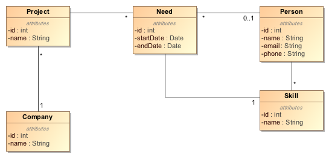
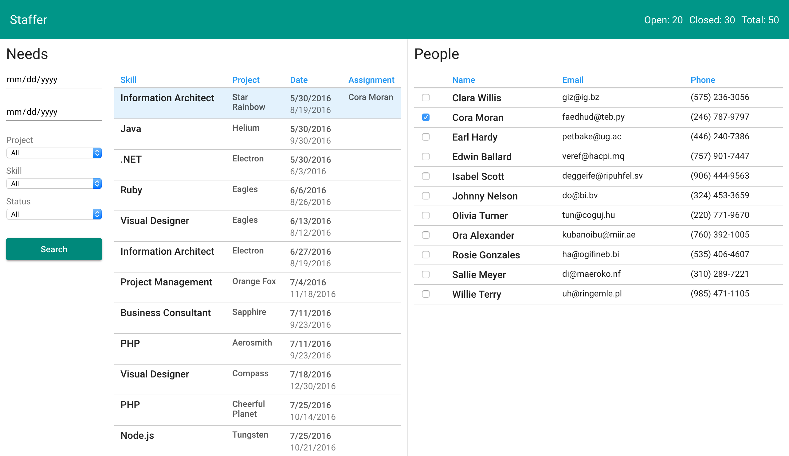

Staffer
=======

Developers today are overloaded with choices when it comes to selecting state management patterns and frameworks for their front-end applications. Redux, Relay, Falcor, RxJS, [Presentational and Container components](https://medium.com/@dan_abramov/smart-and-dumb-components-7ca2f9a7c7d0)... the list goes on and on, but how do you decide on what to use from so many options?

To solve this problem, we created Staffer, a [Todo App](https://github.com/tastejs/todomvc) on steroids for understanding state management techniques. Obviously, state management is a complex topic - so we had to come up with a more complex domain that will allows us to illustrate the patterns and techniques effectively. The domain we picked is *Staffing*.

Think of a consulting firm that provides custom solutions for their clients. The staffing coordinator at this firm must look at all open needs and match them to people with the required skills. Here's the domain model for this problem:

The solution is the Staffer app (see screenshot below). It consists of a single screen showing open needs on the left and matching people on the right. When a specific need is selected, the People Panel on the right should show all the people who have the required skill and are available for the duration of the need. The staffing coordinator should be able to select a subset of the needs by setting appropriate filters on the left. To staff a person, she must click on the checkbox next to the person. This should send a request to the server to staff the person and display the resulting state in the front-end. Specifically, the Needs Panel should show the name of the assigned person and the summary at the top should reflect one more need closed.

Implementations
---------------
Below is the list of current Staffer implementations. We would love to have more! Please see the Contributing section for details.

### staffer-ng2-basic
A very basic implementation using Angular 2 + Angular events + RxJS. This implementation has a few *intentional* bugs to illustrate the problem of state management. Click on a person to assign her to a need - the Needs Panel on the left and the Needs Summary at the top will not reflect the change. Obviously, this can be fixed using more events, but we have left it there as a baseline to improve upon in other implementations.

### staffer-ng2-redux
An implementation of Staffer using Angular 2 + [Redux](http://redux.js.org/) + [ng2-redux](https://github.com/angular-redux/ng2-redux).

### staffer-ng2-ngrxstore
An implementation of Staffer using Angular 2 + [Redux](http://redux.js.org/) + [@ngrx/store](https://github.com/ngrx/store).

### staffer-ng2-falcor
An implementation of Staffer using Angular 2 + [Falcor](http://netflix.github.io/falcor/). (under construction)

Servers
-------
We have implemented the following servers to support various Staffer front-ends.

###staffer-server-rest
This server exposes a RESTful API using Node.js and the Express framework. It also illustrates the use of TypeScript on Node.js. We have created a Gulp-based build system to ease TypeScript development. Changes to the code are monitored by [nodemon](https://github.com/remy/nodemon) and the server will restart automatically to reflect the changes.

### staffer-server-falcor
This server exposes the Staffer model using Falcor. (under construction)

### staffer-server-concepts
This server is used for explaining graph data concepts. We start with a simple tree of needs and progressively enhance it to expose a graph structure using a Falcor model.

Disclaimer
----------
We hope that this project is able to offer assistance in deciding what patterns and frameworks to use for state management. However note that the Staffer application offers a limited view of what these frameworks may be capable of. It is meant to be a starting point to decide what techniques are appropriate for your use case. We heavily recommend investing more time researching techniques that will work for you.

Contributors
------------
 |
:---: |
[Naresh Bhatia](https://github.com/nareshbhatia) |

Contributing
------------
Contributions welcome! If you are passionate about specific state management patterns and frameworks, feel free to open an issue and suggest what you'd like to contribute. For example, you may want to start a Relay implementation. We look forward to seeing your pull requests.

Resources
---------
- [Comparing Redux, Relay and Falcor for State Management](https://drive.google.com/file/d/0Bxd0x47hCRbTSnNpY0ZFV3dYMDQ/view?usp=sharing) - A presentation by Naresh Bhatia explaining various state management techniques.
